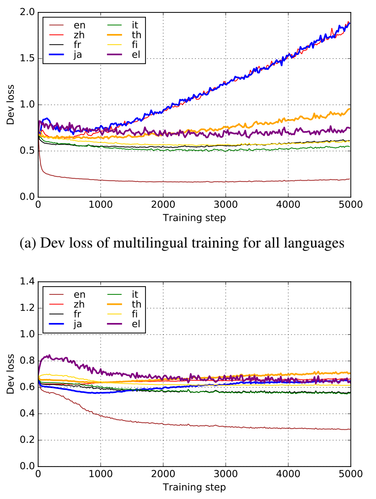
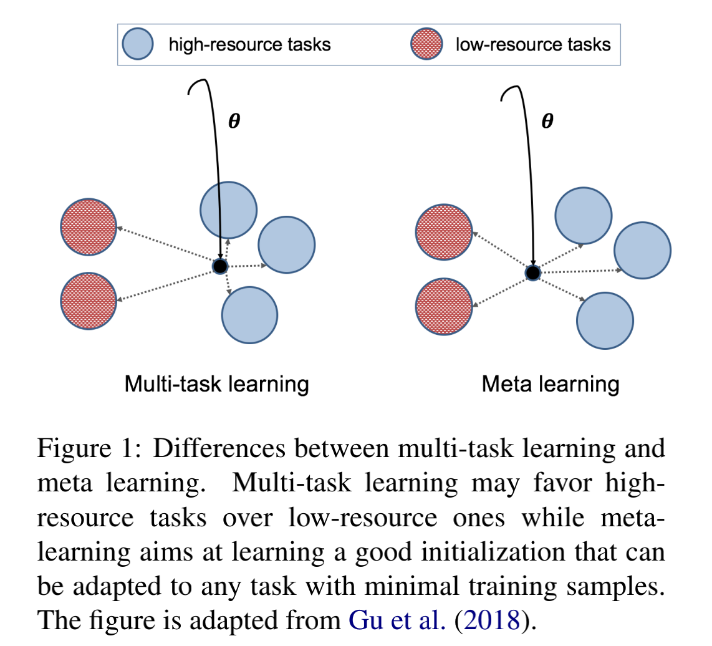

# Meta Learning
- [Meta Learning](#meta-learning)
  - [Hypernymy Detection](#hypernymy-detection)
    - [Hypernymy Detection for Low-Resource Languages via Meta Learning(ACL 2020)](#hypernymy-detection-for-low-resource-languages-via-meta-learningacl-2020)
  - [Natural Language Understanding](#natural-language-understanding)
    - [Investigating Meta-Learning Algorithms for Low-Resource Natural Language Understanding Tasks](#investigating-meta-learning-algorithms-for-low-resource-natural-language-understanding-tasks)

## Hypernymy Detection

### Hypernymy Detection for Low-Resource Languages via Meta Learning(ACL 2020)

1. 创新点

   - 利用高资源语言数据解决低资源上下位词识别问题
   - 实验验证了meta learning能有效缓解在低资源任务上的过拟合问题

2. 方法

   - Cross-lingual Training

     - 一对语言（高资源和低资源语言）间的训练

   - Multilingual Training

     - 训练过程中将所有语言中可用的pairs结合在一起

   - Meta-learning

     - MAML

     

3. 优缺点

   - Meta learning不会偏向于高资源语言的任务
   - 能有效缓解在低资源语言中的过拟合

## Natural Language Understanding

### Investigating Meta-Learning Algorithms for Low-Resource Natural Language Understanding Tasks

1. 创新点

   - 对比了三种meta learning方法在SLU任务中的表现
   - 并对采样任务的三种方法进行了探究
   - 实验证明模型学到的representation可以被有效地迁移到新任务中

2. 模型与方法

   - 三种meta learning方法
     - MAML
     - First-Order MAML
     - Reptile
   - 三种任务采样方法
     - Uniform: 均匀采样
     - Probability Proportional to Size (PPS): 以数据集规模为概率采样
     - Mixed: 在每个epoch，首先均匀采样，然后仅选择target task
   - 

3. 优缺点

   - 多任务学习方法会倾向于拥有大量数据的任务

   

4. 

