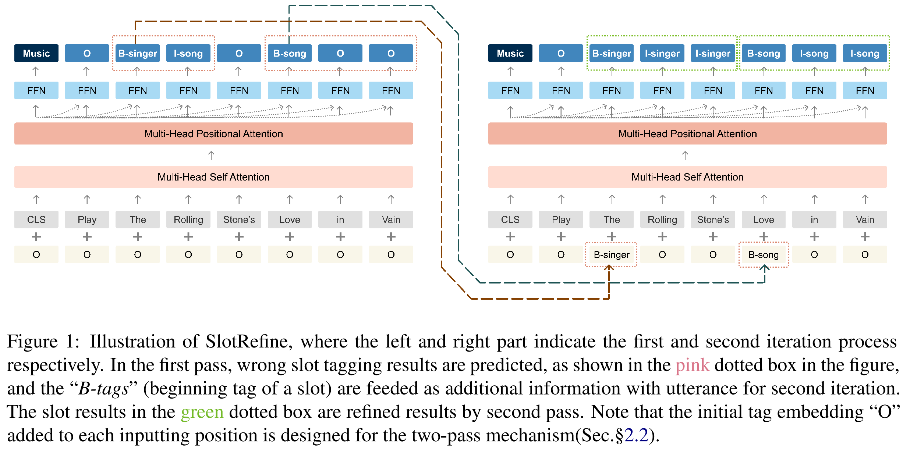

# Slot Filling and Intent Detection               

- [Slot Filling](#slot-filling)
  - [数据集](#数据集)
    - [SNIPS](#snips)
    - [ATIS](#atis)
  - [论文解读](#论文解读)
    - [<a id="dca-net">A Co-Interactive Transformer for Joint Slot Filling and Intent Detection</a>](#a-co-interactive-transformer-for-joint-slot-filling-and-intent-detection)
    - [<a id="slotrefine">SlotRefine: A Fast Non-Autoregressive Model for Joint Intent Detection and Slot Filling</a>](#slotrefine-a-fast-non-autoregressive-model-for-joint-intent-detection-and-slot-filling)
    - [<a id="coach"> Coach: A Coarse-to-Fine Approach for Cross-domain Slot Filling</a>](#-coach-a-coarse-to-fine-approach-for-cross-domain-slot-filling)

# 该任务主要解决什么问题

1. 

# 与NER任务的区别是什么

## 数据集

### SNIPS

[ Coucke et al. (2018)](https://arxiv.org/abs/1805.10190)提出，包含39种slot类型，7个领域，每个领域包含2000条左右训练数据

| train | valid | test |
| :---- | :----- | :---- |
| 13084 | 700 | 700 |

| Models                    |               Slot(F1)               | Intent(Acc) | Overall(Acc) |                            Paper                             | Code                                     | 会议       |
| :------------------------ | :----------------------------------: | :---------: | :----------: | :----------------------------------------------------------: | ---------------------------------------- | ---------- |
| [CM-Net](#cmnet)          |                97.15                 |    99.29    |              | [CM-Net: A Novel Collaborative Memory Network for Spoken Language Understanding](https://arxiv.org/abs/1909.06937) |                                          | EMNLP 2019 |
| [DCA-Net](#dca-net)       |                 95.9                 |    98.8     |     90.3     | [A Co-Interactive Transformer for Joint Slot Filling and Intent Detection](https://arxiv.org/abs/2010.03880) | https://github.com/kangbrilliant/DCA-Net |            |
| [SlotRefine](#slotrefine) |                93.72                 |    97.44    |    84.38     | [SlotRefine: A Fast Non-Autoregressive Model for Joint Intent Detection and Slot Filling](https://arxiv.org/abs/2010.02693) | https://github.com/moore3930/SlotRefine  | EMNLP2020  |
| [Coach](#coach)           | 75.51(Few-shot on 50 (2.5%) samples) |             |              | [Coach: A Coarse-to-Fine Approach for Cross-domain Slot Filling](https://arxiv.org/abs/2004.11727) | https://github.com/zliucr/coach          | ACL2020    |
|                           |                                      |             |              |                                                              |                                          |            |
|                           |                                      |             |              |                                                              |                                          |            |
|                           |                                      |             |              |                                                              |                                          |            |

### ATIS

[ Hemphill et al. (1990)](https://www.aclweb.org/anthology/H90-1021.pdf)提出，数据规模如下：

| train | valid | test |
| :---- | :----- | :---- |
| 4478 | 500 | 893 |

| Models                    | Slot(F1) | Intent(Acc) | Overall(Acc) |                            Paper                             | Code                                     | 会议       |
| :------------------------ | :------: | :---------: | :----------: | :----------------------------------------------------------: | ---------------------------------------- | ---------- |
| [CM-Net](#cmnet)          |   96.2   |    99.10    |              | [CM-Net: A Novel Collaborative Memory Network for Spoken Language Understanding](https://arxiv.org/abs/1909.06937) |                                          | EMNLP 2019 |
| [DCA-Net](#dca-net)       |   95.9   |    97.7     |     87.4     | [A Co-Interactive Transformer for Joint Slot Filling and Intent Detection](https://arxiv.org/abs/2010.03880) | https://github.com/kangbrilliant/DCA-Net |            |
| [SlotRefine](#slotrefine) |  96.22   |    97.11    |    86.96     | [SlotRefine: A Fast Non-Autoregressive Model for Joint Intent Detection and Slot Filling](https://arxiv.org/abs/2010.02693) | https://github.com/moore3930/SlotRefine  | EMNLP2020  |
|                           |          |             |              |                                                              |                                          |            |
|                           |          |             |              |                                                              |                                          |            |
|                           |          |             |              |                                                              |                                          |            |

## 论文解读

### <a id="dca-net">A Co-Interactive Transformer for Joint Slot Filling and Intent Detection</a>

1. 创新点

   - 将vanilla Transformer的self-attention机制加以改造，通过建立SF和ID的双向连接来处理两项任务的相互影响(与以往工作不同的是，论文中两项任务的信息流向为双向的)

2. 模型

   

3. 存在问题

   

### <a id="slotrefine">SlotRefine: A Fast Non-Autoregressive Model for Joint Intent Detection and Slot Filling</a>

1. 创新点

   - 设计了一种两阶段迭代机制解决由非自回归模型的条件独立性引发的槽位不协调问题

2. 模型

   

3. 存在问题

### <a id="coach"> Coach: A Coarse-to-Fine Approach for Cross-domain Slot Filling</a>

1. 创新点

   - 针对特定领域数据稀缺问题，提出一种从粗到细的cross-domain slot filling方法
   - 提出了一种模板正则化方法，通过基于话语模板**对话语表示进行正则化**来提高自适应鲁棒性

2. 模型

   

3.  存在问题

### <a id="cmnet">CM-Net: A Novel Collaborative Memory Network for Spoken Language Understanding</a>

1. 创新点

2. 模型

   

3. 存在问题

4. 

### Discriminative Nearest Neighbor Few-Shot Intent Detection by Transferring Natural Language Inference

## Ⅰ 半监督方法

###  [Semi-supervised training using adversarial multi-task learning for spoken language understanding(IEEE 2018)](https://ieeexplore.ieee.org/abstract/document/8462669/)

1. 创新点
   - 通过注入从无监督数据中抽取到的通用语言信息来微调slot filling模型
   - 包含bidirectional language model(BLM)和slot tagging model(STM)两个任务模型以及一个share model
   - 加入adversarial task discriminator D用于判断共享特征是为哪个任务服务的，获取更多任务无关的共享信息
   - 为了confuse the task discriminator D，共享空间被迫抽取到任务无关知识，并丢弃任务相关信息**（为什么？）**
   - D最大化分辨任务的概率，而share space试图迷惑D，loss中最小化任务分辨概率
   
2. 模型

   

3. 存在问题

### [Semi-Supervised Spoken Language Understanding via Self-Supervised Speech and Language Model Pretraining(2020)](https://arxiv.org/abs/2010.13826)
1. 创新点

   - 与ASR结合

2. 模型

   

3. 存在问题

### [Semi-Supervised Speech-Language Joint Pre-Training for Spoken Language Understanding(2020)](https://arxiv.org/abs/2010.02295)
1. 创新点
	
	- 与ASR结合
	
2. 模型

   

3. 存在问题

## Ⅱ

## Ⅲ

