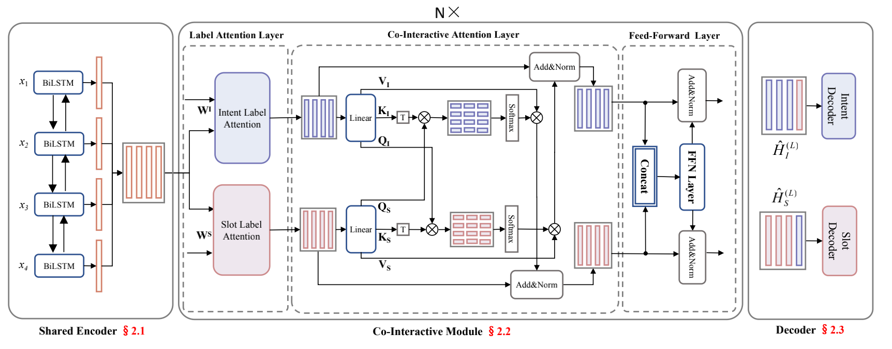
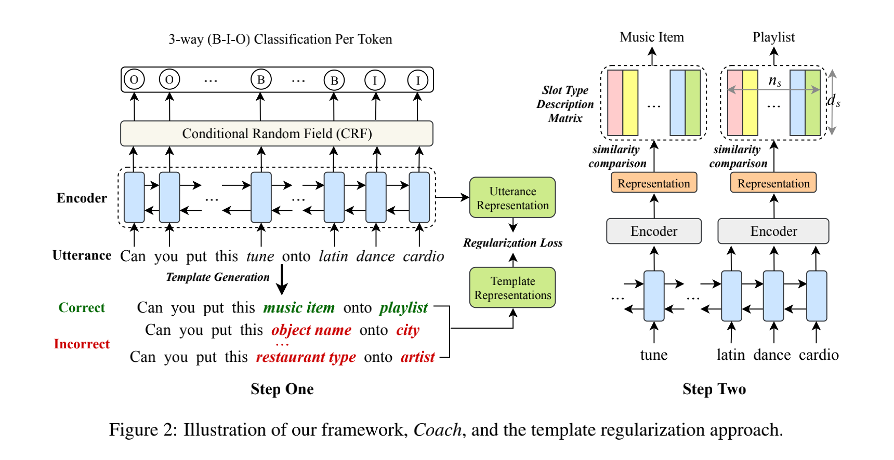

# Slot Filling

- [Slot Filling](#slot-filling)
  - [数据集](#数据集)
    - [SNIPS](#snips)
  - [论文解读](#论文解读)
    - [<a id="dca-net">A Co-Interactive Transformer for Joint Slot Filling and Intent Detection</a>](#a-co-interactive-transformer-for-joint-slot-filling-and-intent-detection)
    - [<a id="coach"> Coach: A Coarse-to-Fine Approach for Cross-domain Slot Filling</a>](#-coach-a-coarse-to-fine-approach-for-cross-domain-slot-filling)

## 数据集

### SNIPS

[ Coucke et al. (2018)](https://arxiv.org/abs/1805.10190)提出，包含39种slot类型，每个领域有200条训练数据

| train | valid | test |
| :---- | :----- | :---- |
| 13084 | 700 | 700 |

| Models              |               Slot(F1)               | Intent(Acc) | Overall(Acc) |                                                    Paper                                                     | Code                                     | 会议    |
| :------------------ | :----------------------------------: | :---------: | :----------: | :----------------------------------------------------------------------------------------------------------: | ---------------------------------------- | ------- |
| [DCA-Net](#dca-net) |                 95.9                 |    98.8     |     90.3     | [A Co-Interactive Transformer for Joint Slot Filling and Intent Detection](https://arxiv.org/abs/2010.03880) | https://github.com/kangbrilliant/DCA-Net |         |
| [Coach](#coach)     | 75.51(Few-shot on 50 (2.5%) samples) |             |              |      [Coach: A Coarse-to-Fine Approach for Cross-domain Slot Filling](https://arxiv.org/abs/2004.11727)      | https://github.com/zliucr/coach          | ACL2020 |
|                     |                                      |             |              |                                                                                                              |                                          |         |
|                     |                                      |             |              |                                                                                                              |                                          |         |
|                     |                                      |             |              |                                                                                                              |                                          |         |

### ATIS

[ Hemphill et al. (1990)](https://www.aclweb.org/anthology/H90-1021.pdf)提出，包含种slot类型，每个领域有条训练数据

| train | valid | test |
| :---- | :----- | :---- |
| 4478 | 500 | 893 |

| Models              |            Slot(F1)             | Intent(Acc) | Overall(Acc) |                            Paper                             | Code                                     | 会议    |
| :------------------ | :-----------------------------: | :---------: | :----------: | :----------------------------------------------------------: | ---------------------------------------- | ------- |
| [DCA-Net](#dca-net) |              95.9               |    97.7     |     87.4     | [A Co-Interactive Transformer for Joint Slot Filling and Intent Detection](https://arxiv.org/abs/2010.03880) | https://github.com/kangbrilliant/DCA-Net |         |
| [Coach](#coach)     | (Few-shot on 50 (2.5%) samples) |             |              | [Coach: A Coarse-to-Fine Approach for Cross-domain Slot Filling](https://arxiv.org/abs/2004.11727) | https://github.com/zliucr/coach          | ACL2020 |
|                     |                                 |             |              |                                                              |                                          |         |
|                     |                                 |             |              |                                                              |                                          |         |
|                     |                                 |             |              |                                                              |                                          |         |

## 论文解读

### <a id="dca-net">A Co-Interactive Transformer for Joint Slot Filling and Intent Detection</a>

1. 创新点

   - 将vanilla Transformer的self-attention机制加以改造，通过建立SF和ID的双向连接来处理两项任务的相互影响(与以往工作不同的是，论文中两项任务的信息流向为双向的)

2. 模型

   

3. 存在问题

### <a id="coach"> Coach: A Coarse-to-Fine Approach for Cross-domain Slot Filling</a>

1. 创新点

   - 针对特定领域数据稀缺问题，提出一种从粗到细的cross-domain slot filling方法
   - 提出了一种模板正则化方法，通过基于话语模板**对话语表示进行正则化**来提高自适应鲁棒性

2. 模型

   

3.  存在问题

