# Slot Filling and Intent Detection               

- [Slot Filling and Intent Detection](#slot-filling-and-intent-detection)
- [该任务主要解决什么问题](#该任务主要解决什么问题)
- [与NER任务的区别是什么](#与ner任务的区别是什么)
  - [数据集](#数据集)
    - [SNIPS](#snips)
    - [ATIS](#atis)
  - [模型改进](#模型改进)
    - [A Co-Interactive Transformer for Joint Slot Filling and Intent Detection](#a-co-interactive-transformer-for-joint-slot-filling-and-intent-detection)
    - [SlotRefine: A Fast Non-Autoregressive Model for Joint Intent Detection and Slot Filling](#slotrefine-a-fast-non-autoregressive-model-for-joint-intent-detection-and-slot-filling)
    - [CM-Net: A Novel Collaborative Memory Network for Spoken Language Understanding](#cm-net-a-novel-collaborative-memory-network-for-spoken-language-understanding)
    - [Discriminative Nearest Neighbor Few-Shot Intent Detection by Transferring Natural Language Inference](#discriminative-nearest-neighbor-few-shot-intent-detection-by-transferring-natural-language-inference)
  - [Ⅰ 半监督方法](#ⅰ-半监督方法)
    - [Semi-supervised training using adversarial multi-task learning for spoken language understanding(IEEE 2018)](#semi-supervised-training-using-adversarial-multi-task-learning-for-spoken-language-understandingieee-2018)
    - [Semi-Supervised Spoken Language Understanding via Self-Supervised Speech and Language Model Pretraining(2020)](#semi-supervised-spoken-language-understanding-via-self-supervised-speech-and-language-model-pretraining2020)
    - [Semi-Supervised Speech-Language Joint Pre-Training for Spoken Language Understanding(2020)](#semi-supervised-speech-language-joint-pre-training-for-spoken-language-understanding2020)
  - [Ⅱ Cross-View Training](#ⅱ-cross-view-training)
    - [To BERT or Not to BERT: Comparing Task-specifific and Task-agnostic Semi-Supervised Approaches for Sequence Tagging(EMNLP 2020)](#to-bert-or-not-to-bert-comparing-task-specifific-and-task-agnostic-semi-supervised-approaches-for-sequence-taggingemnlp-2020)
  - [Ⅲ Meta-Learning](#ⅲ-meta-learning)
  - [Ⅳ Few-shot Learning](#ⅳ-few-shot-learning)
    - [Few-shot Learning for Multi-label Intent Detection(AAAI 2021)](#few-shot-learning-for-multi-label-intent-detectionaaai-2021)
  - [Cross-domain](#cross-domain)
    - [Robust Zero-Shot Cross-Domain Slot Filling with Example Values(ACL 2019)](#robust-zero-shot-cross-domain-slot-filling-with-example-valuesacl-2019)
    - [Coach: A Coarse-to-Fine Approach for Cross-domain Slot Filling(ACL 2020)](#coach-a-coarse-to-fine-approach-for-cross-domain-slot-fillingacl-2020)
    - [Contrastive Zero-Shot Learning for Cross-Domain Slot Filling with Adversarial Attack(COLING 2020)](#contrastive-zero-shot-learning-for-cross-domain-slot-filling-with-adversarial-attackcoling-2020)
  - [其他](#其他)
    - [Style Attuned Pre-training and Parameter Effificient Fine-tuning for Spoken Language Understanding](#style-attuned-pre-training-and-parameter-effificient-fine-tuning-for-spoken-language-understanding)
    - [Augmented Natural Language for Generative Sequence Labeling(EMNLP 2020)](#augmented-natural-language-for-generative-sequence-labelingemnlp-2020)
    - [Recursive Template-based Frame Generation for Task Oriented Dialog(ACL 2020)](#recursive-template-based-frame-generation-for-task-oriented-dialogacl-2020)

# 该任务主要解决什么问题

1. 

# 与NER任务的区别是什么

## 数据集

### SNIPS

[ Coucke et al. (2018)](https://arxiv.org/abs/1805.10190)提出，包含39种slot类型，7个领域，每个领域包含2000条左右训练数据

| train | valid | test |
| :---- | :----- | :---- |
| 13084 | 700 | 700 |

| Models                    |               Slot(F1)               | Intent(Acc) | Overall(Acc) |                            Paper                             | Code                                     | 会议       |
| :------------------------ | :----------------------------------: | :---------: | :----------: | :----------------------------------------------------------: | ---------------------------------------- | ---------- |
| [CM-Net](#cmnet)          |                97.15                 |    99.29    |              | [CM-Net: A Novel Collaborative Memory Network for Spoken Language Understanding](https://arxiv.org/abs/1909.06937) |                                          | EMNLP 2019 |
| [DCA-Net](#dca-net)       |                 95.9                 |    98.8     |     90.3     | [A Co-Interactive Transformer for Joint Slot Filling and Intent Detection](https://arxiv.org/abs/2010.03880) | https://github.com/kangbrilliant/DCA-Net |            |
| [SlotRefine](#slotrefine) |                93.72                 |    97.44    |    84.38     | [SlotRefine: A Fast Non-Autoregressive Model for Joint Intent Detection and Slot Filling](https://arxiv.org/abs/2010.02693) | https://github.com/moore3930/SlotRefine  | EMNLP2020  |
| [Coach](#coach)           | 75.51(Few-shot on 50 (2.5%) samples) |             |              | [Coach: A Coarse-to-Fine Approach for Cross-domain Slot Filling](https://arxiv.org/abs/2004.11727) | https://github.com/zliucr/coach          | ACL2020    |
|                           |                                      |             |              |                                                              |                                          |            |
|                           |                                      |             |              |                                                              |                                          |            |
|                           |                                      |             |              |                                                              |                                          |            |

### ATIS

[ Hemphill et al. (1990)](https://www.aclweb.org/anthology/H90-1021.pdf)提出，数据规模如下：

| train | valid | test |
| :---- | :----- | :---- |
| 4478 | 500 | 893 |

| Models                    | Slot(F1) | Intent(Acc) | Overall(Acc) |                            Paper                             | Code                                     | 会议       |
| :------------------------ | :------: | :---------: | :----------: | :----------------------------------------------------------: | ---------------------------------------- | ---------- |
| [CM-Net](#cmnet)          |   96.2   |    99.10    |              | [CM-Net: A Novel Collaborative Memory Network for Spoken Language Understanding](https://arxiv.org/abs/1909.06937) |                                          | EMNLP 2019 |
| [DCA-Net](#dca-net)       |   95.9   |    97.7     |     87.4     | [A Co-Interactive Transformer for Joint Slot Filling and Intent Detection](https://arxiv.org/abs/2010.03880) | https://github.com/kangbrilliant/DCA-Net |            |
| [SlotRefine](#slotrefine) |  96.22   |    97.11    |    86.96     | [SlotRefine: A Fast Non-Autoregressive Model for Joint Intent Detection and Slot Filling](https://arxiv.org/abs/2010.02693) | https://github.com/moore3930/SlotRefine  | EMNLP2020  |
|                           |          |             |              |                                                              |                                          |            |
|                           |          |             |              |                                                              |                                          |            |
|                           |          |             |              |                                                              |                                          |            |

## 模型改进

### A Co-Interactive Transformer for Joint Slot Filling and Intent Detection

1. 创新点

   - 将vanilla Transformer的self-attention机制加以改造，通过建立SF和ID的双向连接来处理两项任务的相互影响(与以往工作不同的是，论文中两项任务的信息流向为双向的)

2. 模型

   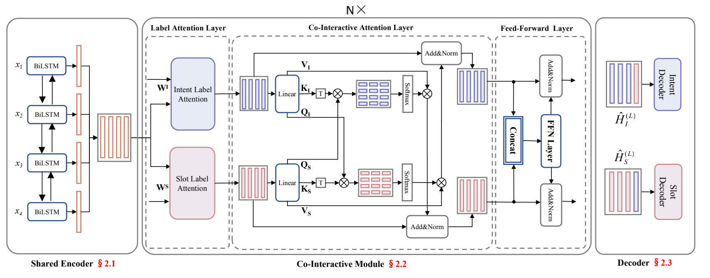

3. 存在问题

   

### SlotRefine: A Fast Non-Autoregressive Model for Joint Intent Detection and Slot Filling

1. 创新点

   - 设计了一种两阶段迭代机制解决由非自回归模型的条件独立性引发的槽位不协调问题

2. 模型

   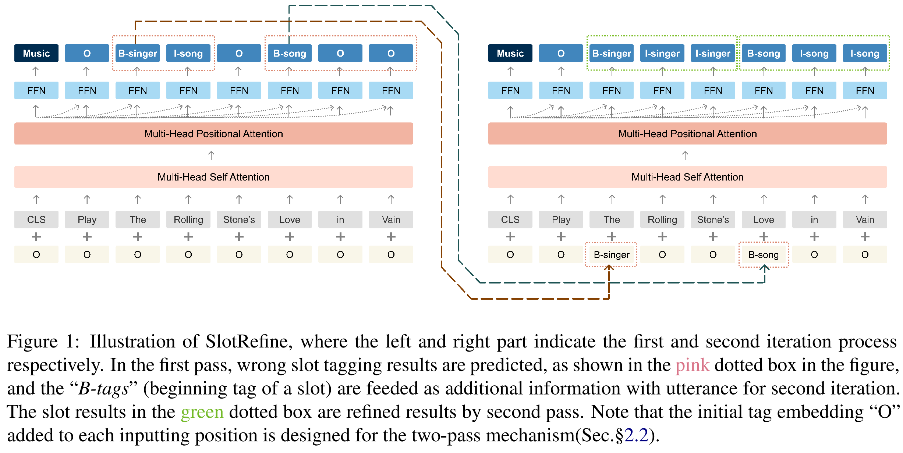

3. 存在问题

### CM-Net: A Novel Collaborative Memory Network for Spoken Language Understanding

1. 创新点

2. 模型

   

3. 存在问题

### Discriminative Nearest Neighbor Few-Shot Intent Detection by Transferring Natural Language Inference

## Ⅰ 半监督方法

###  [Semi-supervised training using adversarial multi-task learning for spoken language understanding(IEEE 2018)](https://ieeexplore.ieee.org/abstract/document/8462669/)

1. 创新点
   - 通过注入从无监督数据中抽取到的通用语言信息来微调slot filling模型
   - 包含bidirectional language model(BLM)和slot tagging model(STM)两个任务模型以及一个share model
   - 加入adversarial task discriminator D用于判断共享特征是为哪个任务服务的，获取更多任务无关的共享信息
   - 为了confuse the task discriminator D，共享空间被迫抽取到任务无关知识，并丢弃任务相关信息**（为什么？）**
   - D最大化分辨任务的概率，而share space试图迷惑D，loss中最小化任务分辨概率
   
2. 模型

   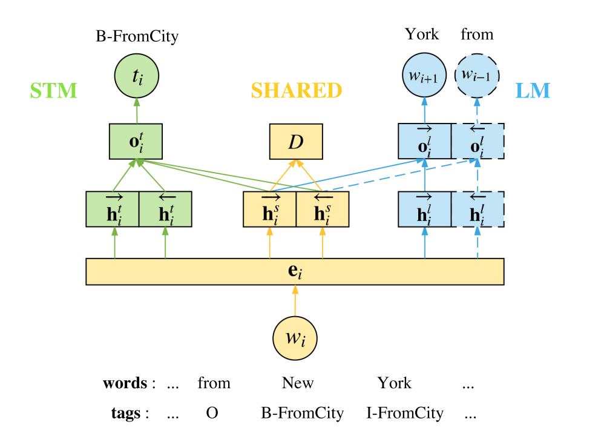

3. 存在问题

### [Semi-Supervised Spoken Language Understanding via Self-Supervised Speech and Language Model Pretraining(2020)](https://arxiv.org/abs/2010.13826)
1. 创新点

   - 与ASR结合

2. 模型

   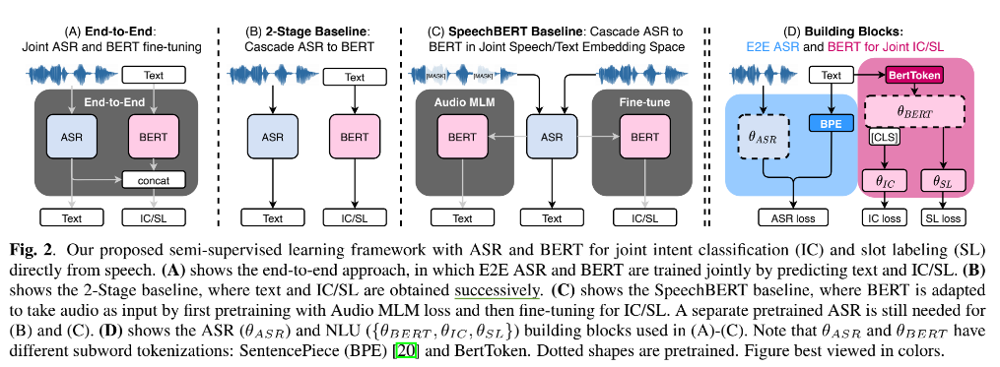

3. 存在问题

### [Semi-Supervised Speech-Language Joint Pre-Training for Spoken Language Understanding(2020)](https://arxiv.org/abs/2010.02295)
1. 创新点
	
	- 与ASR结合
	
2. 模型

   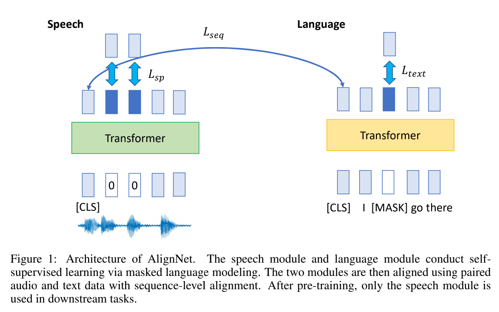

3. 存在问题

## Ⅱ Cross-View Training

1. 创新点
   - 在主要训练阶段，只使用了labeled data，仅能从任务相关数据中学习，限制了模型的泛化能力
   - **Decoder部分**需依据任务的不同而单独设计。而CVT就主要在Decoder端体现。**通过对传入Decoder的feature representation进行不同方式的限制来构造多个view的效果**。然后，以不受限Decoder的输出与每个受限Decoder的输出的差异度量作为监督信号，进行端到端的训练。期望受限Decoder即使在feature representation信息不充分的情况下，也能输出较好的结果，同时，由于整个model的Encoder部分是共享的，在降低该部分loss的时候，也就相应的促使Encoder抽取出更好的feature representation以及提高不受限Decoder的判别能力。 另外，由于这里的监督信号不需要label信息的参与，所以，可以利用大量unlabeled data来对model进行有效泛化。
   - 由于副模型仅在训练时使用，CVT并没有增加inference time和已完全训练模型的参数量
2. 模型
  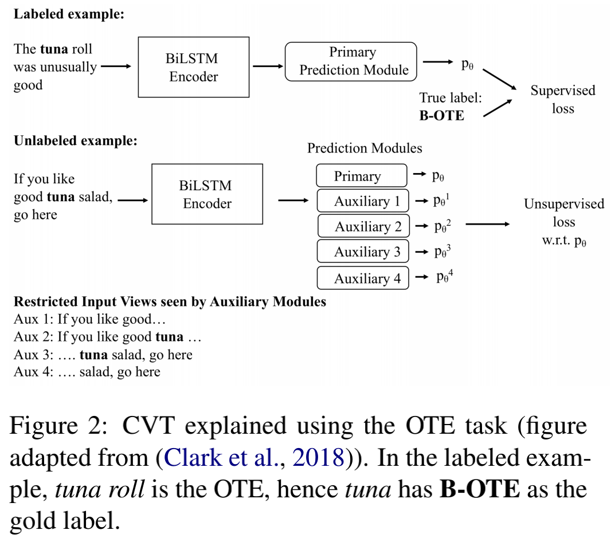
  - encoder部分，采用two-layer CNN-BiLSTM(先采用Char-CNN对character embedding抽取出char represention，再将其余word embedding相拼接作为two-layer BiLSTM的输入)
  - 关于CVT的思想，文章在introduction部分详述了演化过程：首先，如何利用unlabel data呢，作者想到self-training,但是self-training有tautological的问题，即在labeled data上train好的model，先给unlabel data预测一个pseudo-label，并将其加入到label dataset中re-train model。有可能预测的pseudo-label就是错的，再训练反而对错误的信号更confident了。因此，作者想到Deep semi-supervised中的consistency regularization方法（在input加扰动 or 利用NN的随机特性），但是对于NLP问题，不太好给离散的input加扰动。于是，作者从multi-view learning中找到灵感，巧妙的构造了多个view来利用unlabel data。
3. 存在问题

### [To BERT or Not to BERT: Comparing Task-specifific and Task-agnostic Semi-Supervised Approaches for Sequence Tagging(EMNLP 2020)]()

1. 创新点

   - 比较CVT(任务相关)与BERT(任务无关)方法，实验验证了CVT方法在slot filling等任务上的有效性

2. 模型

   - CVT方法中主模型不受限，使用labeled data进行训练
   - 副模型受限，从不同的view在unlabled data中训练，试图模仿主模型的预测结果

3. 存在问题

## Ⅲ Meta-Learning

1. 创新点
2. 模型
3. 存在问题
   - unstable

## Ⅳ Few-shot Learning

### [Few-shot Learning for Multi-label Intent Detection(AAAI 2021)]()

多意图分类的问题：

- 阈值该怎么选（考虑阈值+标签数目）

1. 创新点
   - 在高资源领域学习通用阈值，然后将其泛化到低资源领域
   - 引入label name embedding
2. 模型与方法
3. 存在问题
   - 使用了部分机器学习方法，抽取了特征，并不是每种特征都是有益的
   - 

## Cross-domain
### Robust Zero-Shot Cross-Domain Slot Filling with Example Values(ACL 2019)

1. 创新点

   - 提出使用少量槽位的example values + slot description实现零样本的迁移
   -  

2. 模型

   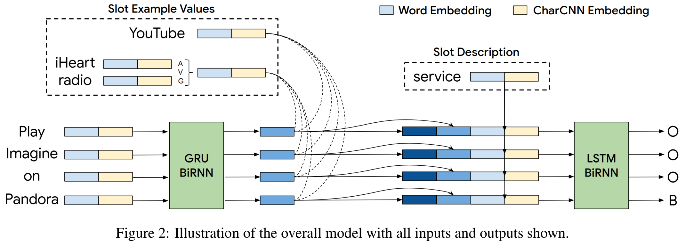

3. 优缺点
   - 当槽位数量比较多时，实现效率不高
   - 会遇到overlapping prediction问题

4. Future Work
- 多标签联合建模是未来发展方向
- 另一个可能的方向是联合zero-shot entity recognition，以降低预测时对example values的需求

### Coach: A Coarse-to-Fine Approach for Cross-domain Slot Filling(ACL 2020)

1. 创新点

   - 针对特定领域数据稀缺问题，提出一种从粗到细的cross-domain slot filling方法
   - 提出了一种模板正则化方法，通过基于话语模板**对话语表示进行正则化**来提高自适应鲁棒性

2. 模型

   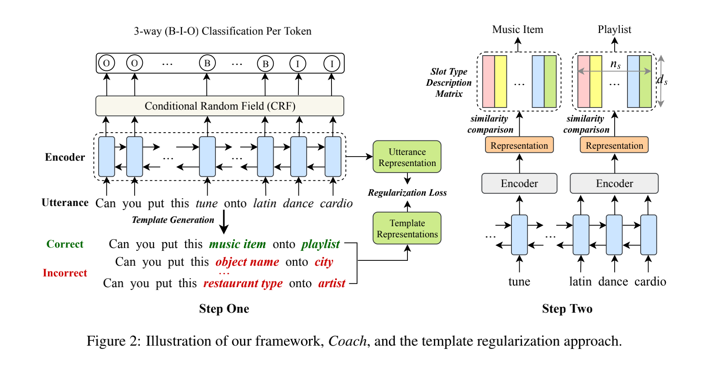

3.  存在问题

### [Contrastive Zero-Shot Learning for Cross-Domain Slot Filling with Adversarial Attack(COLING 2020)]()

1. 创新点

   - 通过构造正负例进行对比学习(Contrastive Learning)
   - 对抗攻击训练提高鲁棒性
   
2. 模型

   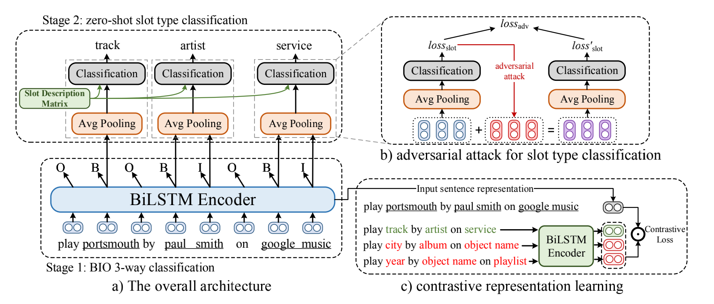

3. 存在问题

## 其他

### [Style Attuned Pre-training and Parameter Effificient Fine-tuning for Spoken Language Understanding]()

1. 创新点

   - 使用带有ASR噪声的对话数据集预训练了对话语言模型(CLM)
   - 并将CLM应用到轻量级的编码器结构

2. 模型

   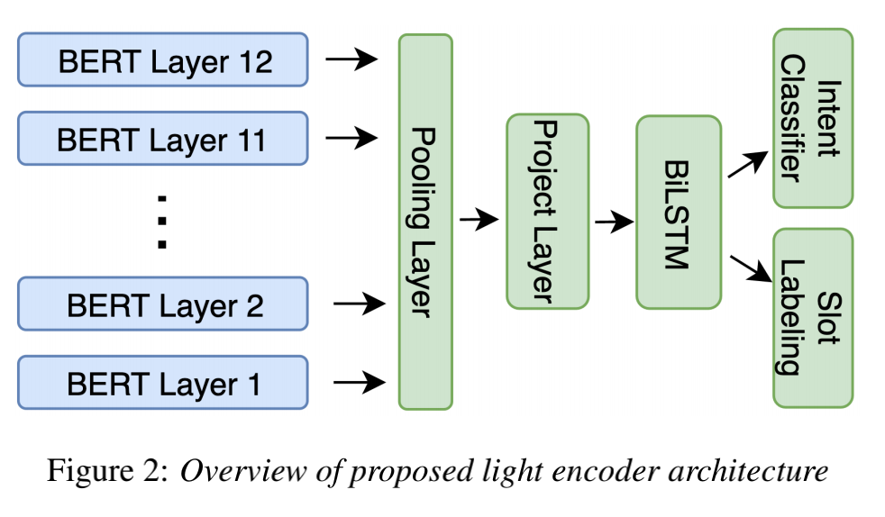

3. 

### Augmented Natural Language for Generative Sequence Labeling(EMNLP 2020)

1. 创新点

   - 将序列标注任务作为生成任务来处理

2. 模型

   

   

3. 结论

   - 在低资源场景上更有效，更方便迁移至新的领域
   - 这种联合的输入输出模式使得模型能

### Recursive Template-based Frame Generation for Task Oriented Dialog(ACL 2020)

1. 创新点

   - 提供了一个迭代的、层级的、基于框架的表示，并展示了如何从数据中进行学习
   - 解码器迭代地生成模板，并将slot value填入模板中
   - 标签具有层次关系，论文试图利用到这种层次关系

2. 模型

   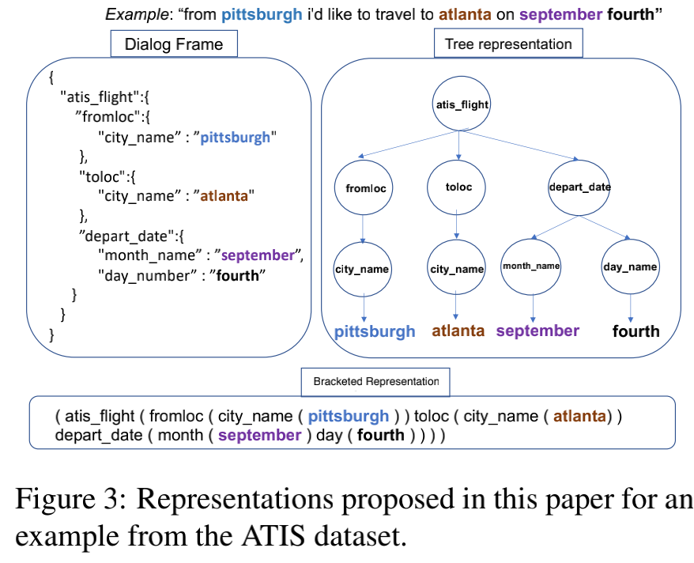

   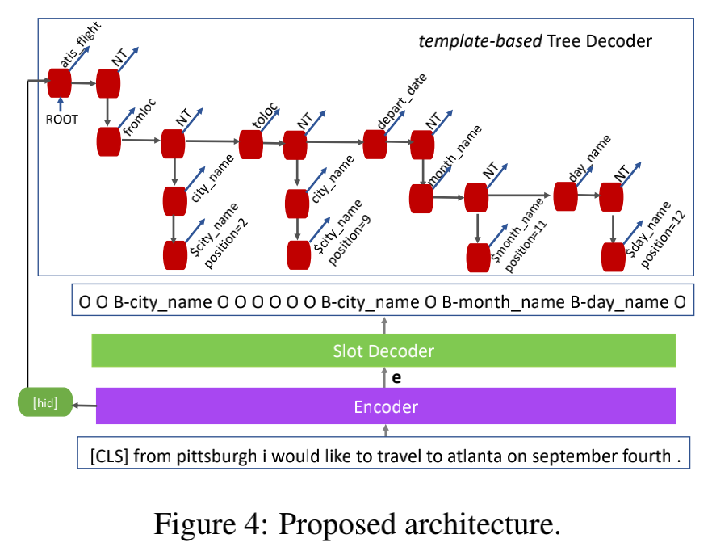

3. 结论

   - 本文提出的方法捕获了槽位标签之间复杂的关系